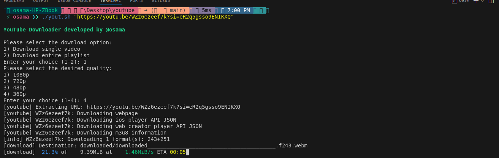

# YouTube Video Downloader

This repository contains a Bash script for downloading videos and playlists from YouTube. The script utilizes the `yt-dlp` and `toilet` libraries to fetch and download videos in various resolutions.

## Features

- Download single videos or entire playlists.
- Select desired video quality (1080p, 720p, 480p, 360p).
- Check for existing files to avoid duplicates.
- User-friendly command-line interface.

## Requirements

- Bash shell
- `yt-dlp` - for downloading videos from YouTube
- `toilet` - for stylized text output

## Installation

1. Clone the repository:
   ```bash
   git clone https://github.com/OsamaRab3/YouTube-Video-Downloader.git
   ```
2. Navigate to the project directory:
    ```bash
    cd YouTube-Video-Downloader
    chmod +x yout.sh
    ```
3. Install the required packages:
    ```bash 
    pip install -r requirements.txt
    ```


## Usage

To download a video or playlist, run the script with the video or playlist URL as an argument


